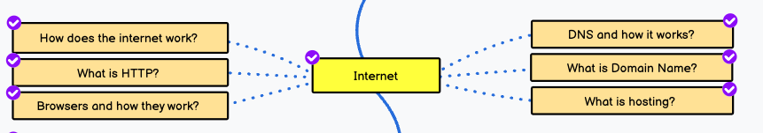

# 📌 - Tabela de Conteudo - Internet

---

## Como funciona a Internet

  
O que é a internet?

  
A internet é uma rede global de computadores interconectados que permite a troca de informações e dados entre eles.

  
Como os computadores se conectam à internet?

  
Os computadores se conectam à internet por meio de um provedor de serviços de internet (ISP) que oferece conexões de banda larga ou discada.

  
O que é um protocolo de internet?

  
Um protocolo de internet é um conjunto de regras e padrões que governam a comunicação entre dispositivos conectados à internet.

  
O que é um endereço IP?

  
Um endereço IP é um número exclusivo que identifica um dispositivo conectado à internet.

  
Qual é a diferença entre um endereço IP público e um endereço IP privado?

  
Um endereço IP público é um endereço único atribuído a um dispositivo na internet, enquanto um endereço IP privado é usado em redes locais para identificar dispositivos conectados a ela.

  
O que é um servidor de nomes de domínio (DNS)?

  
Um servidor de nomes de domínio é um servidor que traduz nomes de domínio legíveis por humanos em endereços IP utilizáveis por computadores.

  
O que é um roteador?

  
Um roteador é um dispositivo que encaminha pacotes de dados entre redes diferentes.

  
O que é um gateway de internet?

  
Um gateway de internet é um dispositivo que conecta redes diferentes, permitindo a comunicação entre elas.

  
Como a criptografia é usada na internet?

  
A criptografia é usada na internet para proteger informações confidenciais, como senhas e informações bancárias, durante a transmissão.

  
O que é um certificado SSL?

  
Um certificado SSL é um tipo de certificado digital que garante a autenticidade de um site e protege as informações transmitidas entre o usuário e o site.

  
O que é um servidor web?

  
Um servidor web é um computador que armazena e distribui conteúdo na internet, como páginas da web e arquivos de mídia.

  
Como funcionam os cookies da web?

  
Os cookies da web são pequenos arquivos de texto armazenados em um dispositivo pelo navegador da web para rastrear o comportamento do usuário na internet e fornecer uma experiência personalizada.

  
Como a tecnologia de armazenamento em nuvem funciona?

  
A tecnologia de armazenamento em nuvem permite que os usuários armazenem e acessem dados e informações pela internet em servidores remotos em vez de armazená-los localmente

---

## HTTP

---

## Navegadores

---

## DNS

---

## Domain

---

## Hosting
